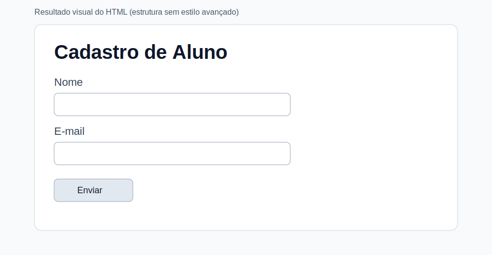
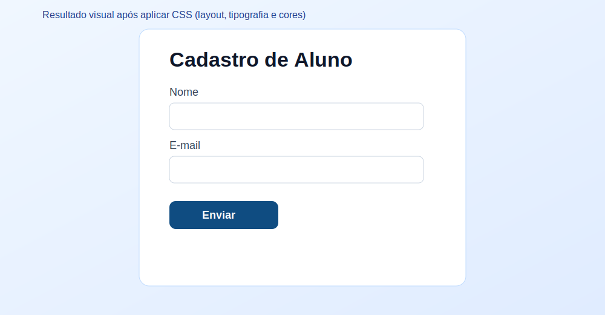
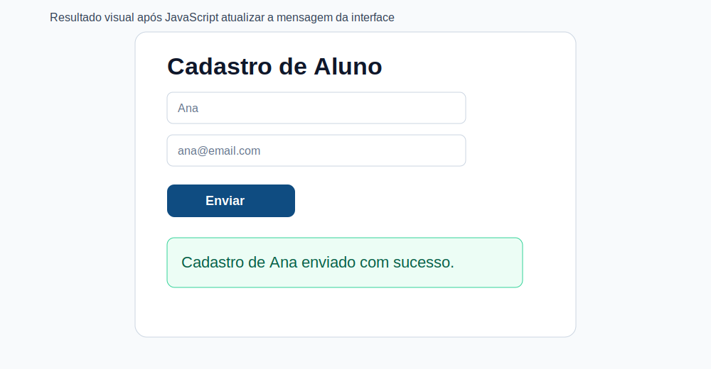
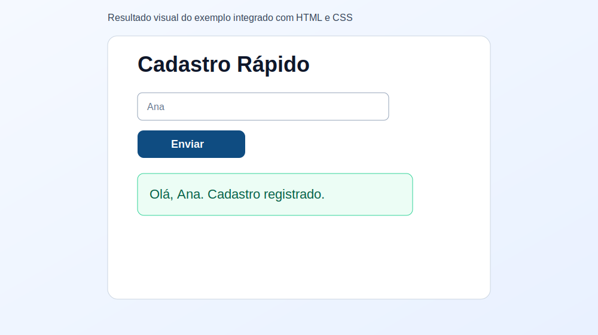

# Encontro 1 - Apresentação da Disciplina, Combinados e Visão Geral da Web

**Unidade:** Unidade 1  
**Carga prevista:** 1,5h  
**Entregável previsto:** Plano de estudo individual

## Visão Geral do Encontro
Este encontro apresenta o panorama completo da Web moderna. O foco é entender como **HTML, CSS e JavaScript** surgiram, por que se tornaram essenciais para a Computação e como atuam juntos na construção de páginas e aplicações web.

<div style="display:flex; align-items:center; gap:12px; flex-wrap:nowrap;">
  
  
  
</div>

## Conceitos Essenciais
- Papel de HTML, CSS e JavaScript no front-end.
- História e evolução dessas linguagens.
- Importância dessas tecnologias para a Computação.

## 1) O que é Front-end?
Front-end é a área do desenvolvimento web responsável por tudo o que o usuário vê e com o que interage no navegador: textos, botões, formulários, menus, imagens, cores, layout e respostas da interface às ações do usuário.

Em termos práticos, o front-end:
- transforma requisitos em interfaces utilizáveis;
- conecta design, usabilidade e programação;
- garante que a aplicação funcione bem em diferentes telas e dispositivos.

No contexto da Web, o front-end é construído principalmente com:
- **HTML** para estrutura;
- **CSS** para apresentação visual;
- **JavaScript** para comportamento e interatividade.

## 2) Papel de HTML, CSS e JavaScript no Front-end
As três linguagens formam uma arquitetura em camadas:

- **HTML (HyperText Markup Language):** define a **estrutura semântica** do conteúdo.
- **CSS (Cascading Style Sheets):** define a **apresentação visual** da interface.
- **JavaScript:** define o **comportamento e a interatividade** da página.

Sem essa separação, o desenvolvimento fica confuso, difícil de manter e menos acessível.

### Definição e aplicação de cada linguagem

#### HTML: estrutura e significado
O HTML organiza o conteúdo em elementos com significado: títulos, parágrafos, seções, formulários, navegação etc.

**Exemplo (HTML):**
```html
<main>
  <h1>Cadastro de Aluno</h1>
  <form id="form-cadastro">
    <label for="nome">Nome</label>
    <input id="nome" type="text" required />

    <label for="email">E-mail</label>
    <input id="email" type="email" required />

    <button type="submit">Enviar</button>
  </form>
  <p id="mensagem"></p>
</main>
```
**Como fica após executar (estrutura HTML):**


Aplicação: estrutura páginas institucionais, portfólios, e-commerces, blogs, sistemas acadêmicos e qualquer interface web.

#### CSS: apresentação visual e layout
O CSS controla cores, fontes, espaçamento, alinhamento e responsividade.

**Exemplo (CSS):**
```css
main {
  max-width: 480px;
  margin: 2rem auto;
  font-family: Arial, sans-serif;
}

form {
  display: grid;
  gap: 0.75rem;
}

button {
  background: #0f4c81;
  color: #fff;
  border: 0;
  padding: 0.6rem 0.8rem;
  cursor: pointer;
}
```
**Como fica após executar (HTML + CSS):**


Aplicação: identidade visual, design system, layout adaptável para celular/tablet/desktop, acessibilidade visual (contraste, legibilidade).

#### JavaScript: interatividade e lógica de interface
O JavaScript reage a eventos do usuário e altera o conteúdo em tempo real.

**Exemplo (JavaScript):**
```js
const form = document.querySelector("#form-cadastro");
const msg = document.querySelector("#mensagem");

form.addEventListener("submit", (e) => {
  e.preventDefault();
  const nome = document.querySelector("#nome").value.trim();
  msg.textContent = `Cadastro de ${nome} enviado com sucesso.`;
});
```
**Como fica após executar (HTML + CSS + JavaScript):**


Aplicação: validação de formulários, menus dinâmicos, filtros, dashboards, comunicação com APIs e aplicações web completas.

## 3) História do HTML, CSS e JavaScript

### HTML
- **Origem:** início dos anos 1990.
- **Criador principal:** Tim Berners-Lee (CERN).
- **Contexto:** facilitar compartilhamento de documentos científicos por hipertexto.
- **Marco histórico:** o primeiro site público da história, hospedado em `info.cern.ch` (1991), foi escrito em HTML.

### CSS
- **Origem:** proposta em 1994.
- **Autores centrais:** Håkon Wium Lie e Bert Bos.
- **Objetivo inicial:** separar conteúdo (HTML) de apresentação (estilo), reduzindo repetição e melhorando manutenção.
- **Marco histórico:** recomendação CSS1 pelo W3C em 1996; início da adoção pelos navegadores na segunda metade dos anos 1990.

### JavaScript
- **Origem:** 1995.
- **Criador:** Brendan Eich (Netscape).
- **Contexto:** adicionar interatividade em páginas que antes eram predominantemente estáticas.
- **Marco histórico:** padronização como **ECMAScript** em 1997.

## 4) Linha do Tempo Resumida

| Ano | Marco |
|---|---|
| 1991 | Primeiro site público em HTML (`info.cern.ch`) |
| 1994 | Proposta inicial de CSS |
| 1995 | Criação do JavaScript na Netscape |
| 1996 | CSS1 publicado pelo W3C |
| 1997 | JavaScript padronizado como ECMAScript |
| 2014 | HTML5 consolidado como recomendação W3C |

## 5) Importância para a Computação
HTML, CSS e JavaScript são fundamentais porque:

- introduzem a base de engenharia de interfaces digitais;
- conectam design, usabilidade e programação;
- viabilizam sistemas distribuídos acessados por navegador;
- sustentam desde páginas simples até aplicações complexas (SaaS, plataformas educacionais, e-commerce, redes sociais);
- formam uma base profissional para desenvolvimento front-end e full-stack.

Em termos de formação, dominar essas tecnologias desenvolve competências de:
- modelagem de informação (HTML semântico);
- pensamento visual e responsivo (CSS);
- raciocínio lógico e orientado a eventos (JavaScript).

## 6) Exemplos Históricos de Uso

### HTML nos primeiros sites
- **`info.cern.ch`**: primeiro site da Web, com páginas textuais e links navegáveis.

### CSS na evolução do design web
- na transição dos anos 1990 para 2000, o CSS passou a substituir estilos inline e tabelas de layout;
- isso permitiu padronização visual, manutenção mais simples e páginas mais leves.

### JavaScript nas primeiras interações populares
- validação de formulários no cliente;
- menus e efeitos de navegação;
- atualização de partes da interface sem recarregar toda a página (evoluindo para AJAX nos anos 2000).

## 7) Exemplo Integrado (HTML + CSS + JavaScript)
```html
<!doctype html>
<html lang="pt-BR">
  <head>
    <meta charset="UTF-8" />
    <meta name="viewport" content="width=device-width, initial-scale=1.0" />
    <title>Exemplo Integrado</title>
    <style>
      body { font-family: Arial, sans-serif; margin: 2rem; }
      .caixa { max-width: 420px; display: grid; gap: 0.75rem; }
      button { background: #0f4c81; color: #fff; border: 0; padding: 0.6rem; }
      #saida { color: #065f46; font-weight: 700; }
    </style>
  </head>
  <body>
    <main class="caixa">
      <h1>Cadastro Rápido</h1>
      <input id="nome" placeholder="Digite seu nome" />
      <button id="btn">Enviar</button>
      <p id="saida"></p>
    </main>

    <script>
      document.querySelector("#btn").addEventListener("click", () => {
        const nome = document.querySelector("#nome").value.trim();
        document.querySelector("#saida").textContent =
          nome ? `Olá, ${nome}. Cadastro registrado.` : "Digite um nome antes de enviar.";
      });
    </script>
  </body>
</html>
```
**Resultado esperado da execução do código do tópico 8:**


## 8) Erros Comuns de Iniciantes
- confundir HTML com linguagem de programação;
- tentar criar layouts complexos sem dominar conceitos básicos;
- usar JavaScript antes de consolidar semântica e estrutura da página;
- copiar código sem testar em pequenas etapas.

## 9) Materiais para Aprofundamento
- [MDN - HTML](https://developer.mozilla.org/pt-BR/docs/Web/HTML)
- [MDN - CSS](https://developer.mozilla.org/pt-BR/docs/Web/CSS)
- [MDN - JavaScript](https://developer.mozilla.org/pt-BR/docs/Web/JavaScript)
- [Curso em Vídeo - A diferença entre HTML, CSS e JavaScript](https://www.youtube.com/watch?v=B4FU3NFRTDw&list=PLHz_AreHm4dkZ9-atkcmcBaMZdmLHft8n&index=10)
- [Curso em Vídeo - Front-end, Back-end e Full stack](https://www.youtube.com/watch?v=iSqf2iPqJNM&list=PLHz_AreHm4dkZ9-atkcmcBaMZdmLHft8n&index=11)

## Checklist de Compreensão
- [ ] Consigo definir HTML, CSS e JavaScript com precisão.
- [ ] Consigo explicar quando e por que cada linguagem surgiu.
- [ ] Consigo citar marcos históricos relevantes (1991, 1994, 1995, 1996, 1997).
- [ ] Consigo relacionar cada linguagem com uma aplicação prática real.
- [ ] Consigo executar e modificar o exemplo integrado.

## Resumo Final
Neste encontro, você construiu uma visão histórica e técnica da Web, entendendo a função de cada linguagem e sua importância para a evolução da Computação. Com essa base, as próximas aulas passam a fazer mais sentido porque cada novo conteúdo será conectado a uma arquitetura clara: **estrutura (HTML), apresentação (CSS) e comportamento (JavaScript)**.

## Questões de Fixação (com gabarito)
1. Qual foi a motivação inicial para o surgimento do HTML?
Gabarito: Compartilhar documentos interligados por hipertexto na Web, inicialmente em contexto científico.

2. Por que o CSS foi criado?
Gabarito: Para separar conteúdo de apresentação, reduzindo repetição e melhorando manutenção visual das páginas.

3. Qual problema o JavaScript resolveu na Web dos anos 1990?
Gabarito: A ausência de interatividade dinâmica no lado do cliente.

4. Cite um marco histórico de cada linguagem.
Gabarito: HTML (primeiro site público em 1991), CSS (CSS1 em 1996), JavaScript (padronização ECMAScript em 1997).

5. Em uma frase, explique como as três linguagens trabalham juntas.
Gabarito: HTML organiza o conteúdo, CSS define a aparência e JavaScript controla o comportamento da interface.
