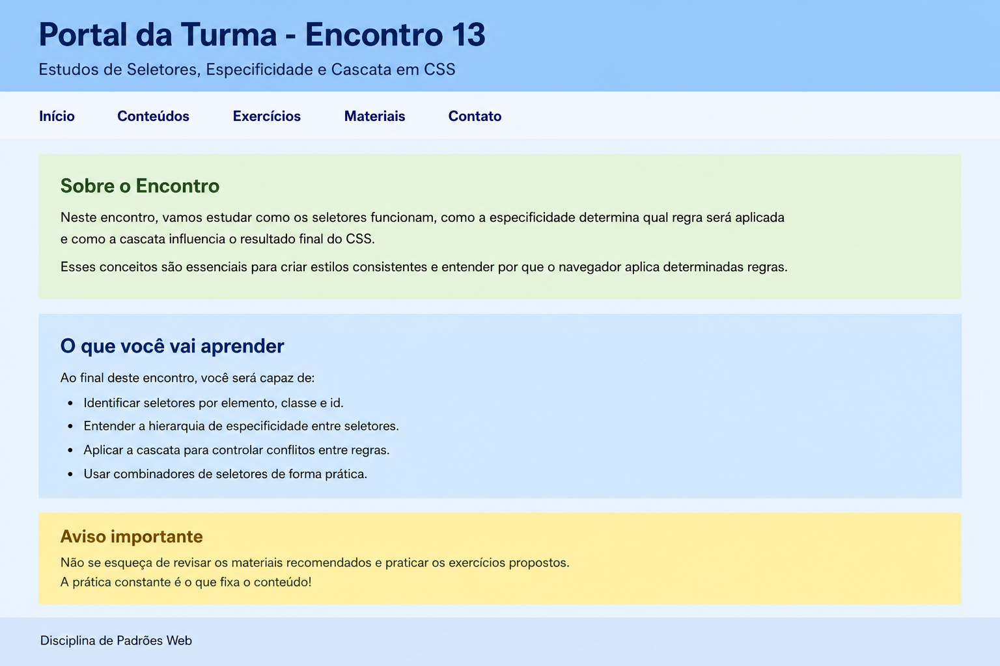

# Encontro 14 - Correção Guiada da Prática do Encontro 13

**Unidade:** Unidade 1  
**Referência:** Correção da prática de seletores em CSS

## Visão Geral
Neste encontro, você faz a correção guiada da prática do Encontro 13.
O foco é revisar os critérios do exercício e consolidar cascata, herança, especificidade e combinadores em uma solução com resultado visual semelhante ao exemplo apresentado no encontro anterior.

## Conceitos Essenciais
- Leitura técnica dos requisitos da prática.
- Revisão de seletores por elemento, classe e id.
- Uso de herança para reduzir repetição.
- Aplicação de combinadores por descendência e filho direto.
- Organização do CSS para chegar a um resultado visual previsível.

## 1) Leitura técnica do enunciado
Antes de corrigir, separe os requisitos em blocos:
- estrutura da página com `header`, `nav`, `main` (2 seções), bloco de destaque e `footer`;
- regra herdada no `body` com `font-family` e `color`;
- regras para `h1`, `p` e `a`;
- uso de seletor por elemento, classe e id;
- uso de combinador por descendência e por filho direto;
- uso de seletor agrupado;
- resultado visual próximo ao exemplo do Encontro 13.

## 2) Planejamento da correção
Sequência sugerida:
- montar o HTML com os mesmos blocos visuais do exemplo;
- definir estilo base no `body`;
- aplicar fundos diferentes em `header`, navegação e seções;
- ajustar títulos, textos e links;
- validar conflitos de prioridade entre classe e id.

## 3) Passo 1 - HTML
```html
<!doctype html>
<html lang="pt-BR">
  <head>
    <meta charset="UTF-8" />
    <meta name="viewport" content="width=device-width, initial-scale=1.0" />
    <title>Portal da Turma - Encontro 13</title>
    <link rel="stylesheet" href="styles.css" />
  </head>
  <body>
    <header id="topo">
      <h1>Portal da Turma - Encontro 13</h1>
      <p class="subtitulo">Estudos de Seletores, Especificidade e Cascata em CSS</p>
    </header>

    <nav class="menu" aria-label="Navegação principal">
      <a href="#inicio">Início</a>
      <a href="#conteudos">Conteúdos</a>
      <a href="#exercicios">Exercícios</a>
      <a href="#materiais">Materiais</a>
      <a href="#contato">Contato</a>
    </nav>

    <main id="inicio">
      <section id="conteudos" class="bloco bloco-sobre">
        <h2>Sobre o Encontro</h2>
        <p>
          Neste encontro, vamos estudar como os seletores funcionam, como a especificidade determina
          qual regra será aplicada e como a cascata influencia o resultado final do CSS.
        </p>
        <p>
          Esses conceitos são essenciais para criar estilos consistentes e entender por que o navegador
          aplica determinadas regras.
        </p>
      </section>

      <section id="exercicios" class="bloco bloco-aprendizado">
        <h2>O que você vai aprender</h2>
        <p>Ao final deste encontro, você será capaz de:</p>
        <ul>
          <li>Identificar seletores por elemento, classe e id.</li>
          <li>Entender a hierarquia de especificidade entre seletores.</li>
          <li>Aplicar a cascata para controlar conflitos entre regras.</li>
          <li>Usar combinadores de seletores de forma prática.</li>
        </ul>
      </section>

      <section id="materiais" class="bloco destaque">
        <h2>Aviso importante</h2>
        <p class="aviso" id="aviso-semana">
          Não se esqueça de revisar os materiais recomendados e praticar os exercícios propostos.
          A prática constante é o que fixa o conteúdo.
        </p>
      </section>
    </main>

    <footer id="contato">
      <p>Disciplina de Padrões Web</p>
    </footer>
  </body>
</html>
```

### O que foi atendido aqui?
- estrutura solicitada no exercício;
- navegação com múltiplos links;
- duas seções principais e um bloco de destaque;
- conteúdo alinhado ao visual de referência.

## 4) Passo 2 - CSS
```css
body {
  background-color: #dce7f6;
  color: #1f2d45;
  font-family: Verdana, sans-serif;
  font-size: 16px;
  line-height: 1.6;
}

header {
  background-color: #92c7ff;
}

h1 {
  color: #0f2a6b;
  font-size: 2rem;
}

h2 {
  font-size: 1.8rem;
}

p {
  color: #1f2d45;
  font-size: 1rem;
}

.subtitulo {
  font-size: 1.3rem;
}

.bloco-sobre {
  background-color: #deecd4;
}

.bloco-sobre h2 {
  color: #214a1f;
}

.bloco-aprendizado {
  background-color: #cfe2f8;
}

.bloco-aprendizado h2 {
  color: #173473;
}

.destaque {
  background-color: #f8e7a3;
}

.destaque h2 {
  color: #6f4b00;
}

.aviso {
  color: #3f3a1f;
  font-weight: 700;
}

#aviso-semana {
  color: #5a4100;
}

main p {
  font-size: 1.2rem;
}

nav {
  background-color: #edf0f5;
}

nav > a {
  text-decoration: none;
  font-weight: 700;
}

nav a {
  color: #11256c;
}

footer {
  background-color: #c9d8eb;
}

h1, h2, h3 {
  font-family: Verdana, sans-serif;
}
```

### O que foi atendido aqui?
- herança no `body` (`font-family` e `color`);
- seletor por elemento, classe e id;
- combinador por descendência (`main p`);
- combinador por filho direto (`nav > a`);
- seletor agrupado (`h1, h2, h3`);
- aplicação de fundos e tipografia no mesmo padrão visual da referência.

## 5) Leitura técnica do conflito de especificidade
No bloco de aviso:
- `.aviso` define cor e peso do texto;
- `#aviso-semana` redefine a cor;
- o id vence na cor final por ter maior especificidade.

## 6) Validação rápida da correção
- Há diferença clara entre seletor de elemento, classe e id.
- Existe herança visível a partir do `body`.
- `nav > a` e `main p` estão corretos como combinadores.
- O agrupamento de títulos evita repetição de regra.
- O resultado visual está semelhante ao exemplo do Encontro 13.

## 7) Resultado visual de referência


## 8) Erros que aparecem com frequência na prática
- esquecer de aplicar classe no HTML e tentar corrigir só no CSS;
- usar id para vários elementos;
- criar regras duplicadas para o mesmo objetivo;
- não perceber que o id sobrescreve a classe;
- aplicar `!important` sem necessidade.

## Materiais para Aprofundamento
- [MDN - Cascata](https://developer.mozilla.org/pt-BR/docs/Web/CSS/Cascade)
- [MDN - Herança em CSS](https://developer.mozilla.org/pt-BR/docs/Web/CSS/inheritance)
- [MDN - Especificidade](https://developer.mozilla.org/pt-BR/docs/Web/CSS/Specificity)
- [MDN - Seletores e combinadores](https://developer.mozilla.org/pt-BR/docs/Web/CSS/CSS_selectors/Selectors_and_combinators)

## Checklist de Compreensão
- [ ] Consigo justificar o uso de elemento, classe e id na mesma página.
- [ ] Consigo explicar um conflito simples de especificidade.
- [ ] Consigo aplicar combinadores sem gerar seleção ampla demais.
- [ ] Consigo organizar um CSS com resultado visual coerente.
- [ ] Consigo comparar minha prática com um resultado de referência.

## Resumo Final
Neste encontro, você corrigiu a prática do Encontro 13 com uma solução comentada e visualmente alinhada ao exemplo de referência.
Com isso, a base de CSS fica mais sólida para os próximos conteúdos.
