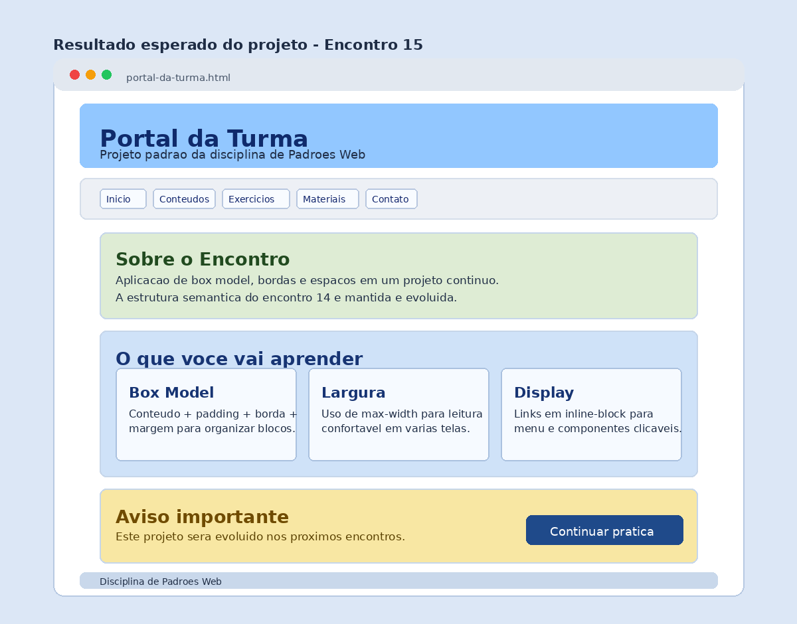

# Encontro 17 - Tamanhos em CSS: `px`, `rem`, `em`, `%`, `vw` e `vh`

**Unidade:** Unidade 1  

## Visão Geral
Neste encontro, você continua exatamente o projeto do Encontro 16.
Até aqui, já aplicamos seletores, box model e Flexbox.
Agora, o foco é controlar melhor **tamanhos de texto, blocos e componentes**.

A ideia é evoluir o mesmo **Portal da Turma** para uma versão com escala visual mais consistente.

## Conceitos Essenciais
- Diferença entre unidades absolutas e relativas.
- `px` para detalhes visuais de precisão.
- `rem` para tipografia e espaçamentos globais.
- `em` para escalonamento interno de componentes.
- `%` para larguras fluidas em relação ao contêiner pai.
- `vw` e `vh` para medidas relacionadas à viewport.
- Valores sem unidade para ritmo de leitura (`line-height`).

## 1) Ponto de partida (Encontro 16)
Você já tem:
- estrutura com `header`, `nav`, `main`, seções e `footer`;
- menu, cards e bloco de destaque com Flexbox;
- classes consolidadas como `.container`, `.bloco`, `.cards-aprendizado`, `.card` e `.botao`.

Agora vamos criar a **versão 4** do projeto, com foco em dimensionamento consistente.

### Referência visual da sequência


## 2) Unidades de tamanho em detalhes
Nesta seção, o objetivo é entender **como pensar** cada unidade antes de escrever o CSS.

### 2.1 `px` (pixel CSS)
`px` é uma unidade fixa de referência visual.
Ela não acompanha automaticamente a escala do contêiner pai.

**Onde usar**
- bordas (`1px`, `2px`);
- sombras e pequenos deslocamentos visuais;
- ajustes finos de acabamento.

**Onde evitar**
- tamanho base de fonte em páginas inteiras;
- espaçamentos principais do layout.

**Exemplo**
```css
.card {
  border: 1px solid #b8c7df;
  border-radius: 8px;
}
```

### 2.2 `rem` (root em)
`rem` sempre usa como base o `font-size` do elemento `html`.
Se `html` for `16px`, então `1rem = 16px`, `1.5rem = 24px`, `0.75rem = 12px`.

**Onde usar**
- tipografia principal (`body`, `h1`, `h2`, `p`);
- espaçamentos globais (`padding`, `margin`, `gap`);
- escala visual consistente do projeto.

**Onde evitar**
- detalhes que precisam de precisão fixa de 1 pixel.

**Exemplo**
```css
html {
  font-size: 16px;
}

body {
  font-size: 1rem;
}

.bloco {
  padding: 1rem;
  margin-bottom: 1rem;
}
```

### 2.3 `em` (escala local)
`em` usa o tamanho de fonte do próprio contexto.
Isso significa que o valor pode “crescer em cadeia” se houver herança acumulada.

**Onde usar**
- componentes que devem escalar junto com o texto local;
- botões dentro de cards com variação de tamanho;
- elementos internos que dependem da hierarquia do componente.

**Onde evitar**
- estruturas muito profundas sem controle de herança.

**Exemplo**
```css
.card-escala {
  font-size: 1.125rem;
}

.card-escala .botao {
  font-size: 1em;
  padding: 0.6em 1em;
}
```

### 2.4 `%` (porcentagem)
`%` é sempre relativo ao tamanho do elemento pai.
Para largura de blocos, é uma das formas mais simples de criar comportamento fluido.

**Onde usar**
- largura de colunas e blocos (`50%`, `75%`, `100%`);
- ajustes proporcionais em elementos internos.

**Onde evitar**
- quando o elemento pai não tem dimensão clara;
- quando você precisa de limite mínimo e máximo (nesses casos, combine com `min/max`).

**Exemplo**
```css
.largura-100 {
  width: 100%;
}

.largura-75 {
  width: 75%;
}

.largura-50 {
  width: 50%;
}
```

### 2.5 `vw` (viewport width)
`vw` usa a largura da janela.
`1vw` equivale a 1% da largura visível da tela.

**Onde usar**
- ajustes fluidos que acompanham a largura da viewport;
- tipografia fluida em conjunto com `clamp()`.

**Onde evitar**
- fonte definida apenas com `vw`, porque pode ficar pequena demais em telas estreitas.

**Entendendo melhor `clamp()`**
`clamp()` define um valor com limite mínimo e máximo.
A estrutura é:

```css
propriedade: clamp(valor-minimo, valor-ideal, valor-maximo);
```

No exemplo do encontro:
```css
font-size: clamp(1rem, 0.9rem + 0.6vw, 1.35rem);
```

Leitura prática:
1. `1rem` é o menor tamanho permitido.
2. `0.9rem + 0.6vw` é o valor que cresce de forma fluida com a largura da tela.
3. `1.35rem` é o maior tamanho permitido.

Resultado:
- em telas pequenas, a fonte não desce abaixo de `1rem`;
- em telas médias, a fonte cresce de forma gradual;
- em telas grandes, a fonte para de crescer em `1.35rem`.

**Exemplo**
```css
.texto-fluido {
  font-size: clamp(1rem, 0.9rem + 0.6vw, 1.35rem);
}
```

### 2.6 `vh` (viewport height)
`vh` usa a altura da janela.
`1vh` equivale a 1% da altura visível da tela.

**Onde usar**
- altura mínima de faixas de destaque;
- seções de entrada (hero/topo) que precisam “respirar”.

**Onde evitar**
- altura fixa de conteúdo textual grande, para não cortar texto.

**Exemplo**
```css
#topo {
  min-height: 18vh;
}
```

### 2.7 `line-height` sem unidade (valor unitless)
`line-height` aceita valores com unidade (`px`, `rem`, `%`) e sem unidade.
Quando você usa sem unidade, como `line-height: 1.6;`, o número funciona como um multiplicador do `font-size` atual.

Exemplo rápido:
- se o texto estiver com `font-size: 16px`, `line-height: 1.6` resulta em `25.6px`;
- se outro elemento estiver com `font-size: 20px`, o mesmo `line-height: 1.6` vira `32px`.

**Por que isso é útil**
- mantém proporção de entrelinha mesmo quando a fonte muda;
- herda melhor entre elementos com tamanhos diferentes;
- evita ajustes manuais em cada breakpoint.

**Quando usar**
- textos corridos, parágrafos, listas e áreas de leitura.

**Quando evitar**
- casos de alinhamento visual muito rígido, em que você precisa de valor fixo.

**Exemplo**
```css
body {
  font-size: 1rem;
  line-height: 1.6;
}
```

### 2.8 Estratégia recomendada para este projeto
- Use `rem` como padrão para fontes e espaçamentos.
- Use `px` para bordas e acabamento fino.
- Use `%` para larguras fluidas dentro de contêineres.
- Use `em` para componentes que precisam escalar localmente.
- Use `vw` e `vh` de forma pontual, com limites de legibilidade.
- Use `line-height` sem unidade em textos para preservar proporção entre fontes.

## 3) Objetivo da evolução
Ao final desta aula, o projeto deve ter:
- tipografia com escala previsível usando `rem`;
- componentes com espaçamentos consistentes;
- exemplos práticos de `px`, `em` e `%` no mesmo layout;
- uso pontual de `vw` e `vh` para fluidez;
- base pronta para o Encontro 18 (responsividade com media queries).

## 4) Passo 1 - HTML evoluído 
No HTML, mantemos a mesma estrutura do Encontro 16 e adicionamos apenas elementos de apoio para estudar tamanhos.

```html
<!doctype html>
<html lang="pt-BR">
  <head>
    <meta charset="UTF-8" />
    <meta name="viewport" content="width=device-width, initial-scale=1.0" />
    <title>Portal da Turma - Projeto Padrão</title>
    <link rel="stylesheet" href="styles.css" />
  </head>
  <body>
    <header id="topo" class="faixa">
      <div class="container">
        <h1>Portal da Turma</h1>
        <p class="subtitulo texto-fluido">Projeto padrão da disciplina de Padrões Web</p>
      </div>
    </header>

    <nav class="menu faixa" aria-label="Navegação principal">
      <div class="container">
        <a href="#inicio">Início</a>
        <a href="#conteudos">Conteúdos</a>
        <a href="#exercicios">Exercícios</a>
        <a href="#materiais">Materiais</a>
        <a href="#contato">Contato</a>
      </div>
    </nav>

    <main id="inicio" class="container">
      <section id="conteudos" class="bloco bloco-sobre">
        <h2>Sobre o Encontro</h2>
        <p>
          Neste encontro, evoluímos o mesmo projeto para estudar como `px`, `rem`, `em`, `%`,
          `vw` e `vh` afetam tipografia, espaçamentos e dimensões de blocos.
        </p>
      </section>

      <section id="exercicios" class="bloco bloco-aprendizado">
        <h2>O que você vai aprender</h2>
        <div class="cards-aprendizado">
          <article class="card">
            <h3>`px` e `rem`</h3>
            <p>Quando usar precisão fixa e quando usar escala global.</p>
          </article>
          <article class="card card-escala">
            <h3>`em` em componentes</h3>
            <p>Como o botão cresce junto com o tamanho do texto do card.</p>
            <a class="botao" href="#materiais">Ver exemplo</a>
          </article>
          <article class="card">
            <h3>Largura em `%`</h3>
            <p>Como blocos ocupam mais ou menos espaço com base no contêiner pai.</p>
          </article>
        </div>
      </section>

      <section id="materiais" class="bloco destaque">
        <h2>Aviso importante</h2>
        <div class="destaque-acao">
          <p class="aviso" id="aviso-semana">
            Este projeto continua evoluindo e, neste encontro, o foco é aplicar unidades de tamanho
            com critério para manter legibilidade e consistência visual.
          </p>
          <a class="botao" href="#exercicios">Continuar prática</a>
        </div>

        <div class="amostras-largura">
          <div class="amostra largura-100">`width: 100%`</div>
          <div class="amostra largura-75">`width: 75%`</div>
          <div class="amostra largura-50">`width: 50%`</div>
        </div>
      </section>
    </main>

    <footer id="contato" class="faixa">
      <div class="container">
        <p>Disciplina de Padrões Web</p>
      </div>
    </footer>
  </body>
</html>
```

### O que mudou no HTML?
- a estrutura-base do Encontro 16 foi preservada (`header`, `nav`, `main`, `footer` e `.destaque-acao`);
- inclusão da classe `.texto-fluido` para exemplo de tipografia com viewport;
- inclusão da classe `.card-escala` para demonstrar `em` no componente;
- criação do bloco `.amostras-largura` para comparar `%` na prática, sem remover elementos anteriores.

## 5) Passo 2 - CSS
Mantenha as regras já construídas nos Encontros 14, 15 e 16.
Neste encontro, adicione as regras abaixo para controlar tamanhos com mais consistência.

### Etapa 2.1 - Regra 1: base tipográfica com `rem`
```css
html {
  font-size: 16px;
}

:root {
  --fs-1: 0.875rem;
  --fs-2: 1rem;
  --fs-3: 1.25rem;
  --space-1: 0.5rem;
  --space-2: 1rem;
  --space-3: 1.5rem;
}
```
**Explicação linha a linha**
- `html { font-size: 16px; }`: define a base para cálculo de `rem`.
- `:root`: cria variáveis globais reutilizáveis.
- `--fs-*`: escala de tamanho de fonte em `rem`.
- `--space-*`: escala de espaçamento em `rem`.

**Para que serve no projeto**
- padroniza fonte e espaçamento;
- facilita ajustes globais sem editar regra por regra.

### Etapa 2.2 - Regra 2: tipografia principal em `rem`
```css
body {
  font-size: var(--fs-2);
  line-height: 1.6;
}

h1 {
  font-size: 2rem;
}

h2 {
  font-size: var(--fs-3);
}

p,
.card p,
.menu a {
  font-size: var(--fs-2);
}
```
**Explicação linha a linha**
- `font-size: var(--fs-2)`: usa a escala global em `rem`.
- `line-height: 1.6`: valor sem unidade; funciona como multiplicador do `font-size` atual.
- se a fonte for `16px`, a linha fica em `25.6px`; se a fonte for `20px`, a linha vira `32px`.
- por isso, o valor unitless preserva ritmo de leitura quando o tamanho de fonte muda.
- `h1` e `h2`: mantêm hierarquia visual previsível.
- bloco agrupado de texto: garante consistência tipográfica no projeto.

**Para que serve no projeto**
- mantém ritmo visual entre títulos, textos e menu;
- evita tamanhos “soltos” em cada componente.

### Etapa 2.3 - Regra 3: `px` para detalhes de precisão
```css
.bloco {
  border: 1px solid #c6d6ea;
  border-radius: 8px;
}

.card {
  border: 1px solid #b8c7df;
}
```
**Explicação linha a linha**
- `1px`: espessura fina e previsível para bordas.
- `border-radius: 8px`: arredondamento visual constante.

**Para que serve no projeto**
- usa `px` onde precisão visual é desejada;
- mantém acabamento nítido em cartões e blocos.

### Etapa 2.4 - Regra 4: espaçamento em `rem`
```css
.bloco {
  padding: var(--space-2);
  margin-bottom: var(--space-2);
}

.card {
  padding: var(--space-2);
}
```
**Explicação linha a linha**
- `padding` e `margin-bottom` usam a mesma escala em `rem`.
- os cards reaproveitam a variável para manter consistência.

**Para que serve no projeto**
- facilita manter proporção entre componentes;
- melhora manutenção do CSS com menos valores isolados.

### Etapa 2.5 - Regra 5: `em` dentro do componente
```css
.card-escala {
  font-size: 1.125rem;
}

.card-escala .botao {
  font-size: 1em;
  padding: 0.6em 1em;
}
```
**Explicação linha a linha**
- `.card-escala`: aumenta ligeiramente o tamanho base do card.
- `font-size: 1em`: botão herda a escala local desse card.
- `padding` em `em`: o espaçamento do botão cresce junto com o texto.

**Para que serve no projeto**
- mostra como `em` é útil para componentes autoescaláveis;
- evita ajustar manualmente cada tamanho quando o card muda.

### Etapa 2.6 - Regra 6: `%` para largura de blocos
```css
.amostras-largura {
  display: grid;
  gap: 0.75rem;
}

.amostra {
  padding: 0.5rem 0.75rem;
  border: 1px dashed #8aa1c3;
  background-color: #f6fbff;
  font-family: Consolas, monospace;
}

.largura-100 {
  width: 100%;
}

.largura-75 {
  width: 75%;
}

.largura-50 {
  width: 50%;
}
```
**Explicação linha a linha**
- `%` calcula a largura com base no pai (`.amostras-largura`).
- `width: 100%`, `75%` e `50%`: permitem comparação direta no mesmo contexto.

**Para que serve no projeto**
- reforça a lógica de largura fluida;
- prepara para ajustes responsivos do encontro seguinte.

### Etapa 2.7 - Regra 7: `vw` e `vh` de forma controlada
```css
#topo {
  min-height: 18vh;
}

.texto-fluido {
  font-size: clamp(1rem, 0.9rem + 0.6vw, 1.35rem);
}
```
**Explicação linha a linha**
- `min-height: 18vh`: define altura mínima do topo proporcional à altura da tela.
- `clamp(1rem, 0.9rem + 0.6vw, 1.35rem)`: define um piso, uma faixa fluida e um teto para a fonte.
- `1rem`: tamanho mínimo (a fonte nunca fica menor que isso).
- `0.9rem + 0.6vw`: parte fluida, que acompanha a largura da viewport.
- `1.35rem`: tamanho máximo (a fonte para de crescer ao atingir esse valor).

**Exemplo numérico rápido**
- se o cálculo do meio resultar em `0.95rem`, o navegador usa `1rem` (mínimo).
- se resultar em `1.2rem`, o navegador usa `1.2rem` (faixa fluida).
- se resultar em `1.5rem`, o navegador usa `1.35rem` (máximo).

**Para que serve no projeto**
- adiciona fluidez sem exageros;
- evita texto minúsculo ou grande demais em telas extremas.

### CSS novo deste encontro (resumo)
```css
html {
  font-size: 16px;
}

:root {
  --fs-1: 0.875rem;
  --fs-2: 1rem;
  --fs-3: 1.25rem;
  --space-1: 0.5rem;
  --space-2: 1rem;
  --space-3: 1.5rem;
}

body {
  font-size: var(--fs-2);
  line-height: 1.6;
}

h1 {
  font-size: 2rem;
}

h2 {
  font-size: var(--fs-3);
}

p,
.card p,
.menu a {
  font-size: var(--fs-2);
}

.bloco {
  border: 1px solid #c6d6ea;
  border-radius: 8px;
  padding: var(--space-2);
  margin-bottom: var(--space-2);
}

.card {
  border: 1px solid #b8c7df;
  padding: var(--space-2);
}

.card-escala {
  font-size: 1.125rem;
}

.card-escala .botao {
  font-size: 1em;
  padding: 0.6em 1em;
}

.amostras-largura {
  display: grid;
  gap: 0.75rem;
}

.amostra {
  padding: 0.5rem 0.75rem;
  border: 1px dashed #8aa1c3;
  background-color: #f6fbff;
  font-family: Consolas, monospace;
}

.largura-100 {
  width: 100%;
}

.largura-75 {
  width: 75%;
}

.largura-50 {
  width: 50%;
}

#topo {
  min-height: 18vh;
}

.texto-fluido {
  font-size: clamp(1rem, 0.9rem + 0.6vw, 1.35rem);
}
```

## 6) Validação rápida da versão 4
- Tipografia principal foi definida com `rem`.
- Bordas e detalhes finos usam `px`.
- O botão do card de escala usa `em` e cresce junto com o componente.
- O laboratório mostra claramente diferença entre `100%`, `75%` e `50%`.
- O topo e o subtítulo usam `vh`/`vw` de forma controlada.

## 7) Erros comuns nesta evolução
- usar `px` para tudo e perder flexibilidade;
- usar `%` sem entender qual é o elemento pai de referência;
- aplicar `em` sem perceber que ele multiplica com heranças de fonte;
- exagerar em `vw` para texto e prejudicar legibilidade;
- misturar muitos valores sem uma escala base (`:root`).

## 8) Prática Final - Projeto Padrão da Disciplina (Versão 4)
Nesta versão, o projeto mantém a base do Encontro 16 e evolui com foco total em dimensionamento.
A meta é justificar tecnicamente quando usar `px`, `rem`, `em`, `%`, `vw` e `vh`.

### Ajustes sugeridos
1. Aumente `html { font-size }` para `18px` e observe quais partes escalam automaticamente.
2. Teste `.largura-75` e `.largura-50` em diferentes tamanhos de janela.
3. Crie uma variação `.card-escala-grande` e compare com `.card-escala`.
4. Reduza e amplie a janela para validar o comportamento de `.texto-fluido`.
5. Revise se há medidas repetidas que podem virar variáveis em `:root`.

### Critérios de validação
- O projeto demonstra, na prática, uso de `px`, `rem`, `em`, `%`, `vw` e `vh`.
- Tipografia e espaçamentos têm padrão de escala coerente.
- Larguras relativas funcionam sem quebrar o layout.
- A base do Encontro 16 foi preservada e evoluída.

## Materiais para Aprofundamento
- [MDN - Unidades e valores CSS](https://developer.mozilla.org/pt-BR/docs/Learn_web_development/Core/Styling_basics/Values_and_units)
- [MDN - `length`](https://developer.mozilla.org/pt-BR/docs/Web/CSS/length)
- [MDN - `clamp()`](https://developer.mozilla.org/pt-BR/docs/Web/CSS/clamp)
- [MDN - `font-size`](https://developer.mozilla.org/pt-BR/docs/Web/CSS/font-size)

## Checklist de Compreensão
- [ ] Consigo explicar diferença entre unidade absoluta e relativa.
- [ ] Consigo justificar quando usar `px` e quando usar `rem`.
- [ ] Consigo usar `em` para escalar componentes internos.
- [ ] Consigo usar `%` com base no contêiner pai.
- [ ] Consigo aplicar `vw`/`vh` com controle de legibilidade.

## Resumo Final
Neste encontro, você evoluiu o mesmo Portal da Turma com uma estratégia clara de tamanhos em CSS.
Com isso, o projeto fica mais consistente e pronto para o próximo passo: responsividade com media queries no Encontro 18.
