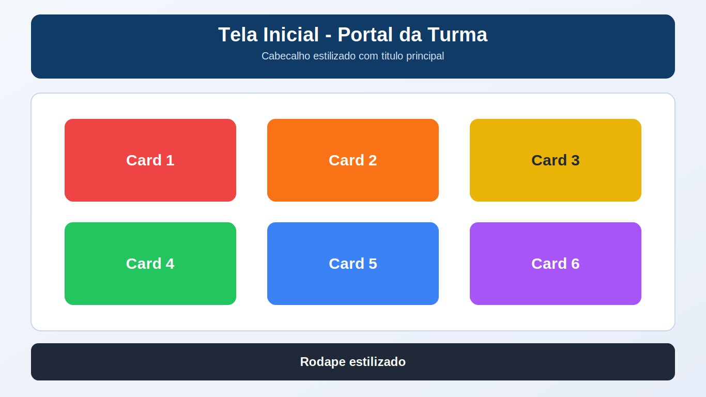

# Encontro 21 - Correção Guiada da Avaliação 02

**Unidade:** Unidade 2 (fechamento técnico da Unidade 1)  
**Referência:** Correção da Avaliação 02 (CSS)

## Visão Geral
Neste encontro, você faz a correção guiada da atividade avaliativa sobre a tela inicial de um portal acadêmico da turma.
O foco é revisar cada requisito do enunciado, compreender uma solução possível e identificar como HTML e CSS trabalham juntos na construção de uma interface organizada, responsiva e visualmente coerente.

Se no Encontro 20 você resolveu a atividade de forma autoral, agora você compara sua implementação com uma proposta comentada, verifica os critérios de avaliação e registra os ajustes necessários.

> A solução apresentada não é a única resposta correta. Cores, textos e algumas medidas podem variar, desde que todos os requisitos técnicos sejam atendidos.

## Conceitos Essenciais
- Leitura do enunciado por blocos de requisito.
- Separação entre estrutura HTML e apresentação visual.
- Uso de seletores por elemento, classe e id.
- Aplicação consciente de cascata e herança.
- Construção dos cards com box model e Flexbox.
- Uso combinado de unidades absolutas, relativas e de viewport.
- Validação técnica e visual da interface.

## 1) Leitura técnica do enunciado
Antes de corrigir o código, o primeiro passo é decompor a atividade em partes menores:
- estrutura HTML5 completa;
- arquivo `styles.css` externo e corretamente vinculado;
- organização semântica com `header`, `main` e `footer`;
- cabeçalho com título principal;
- seção com exatamente 6 cards;
- título, cor de fundo, borda, espaçamento interno e cantos arredondados em cada card;
- rodapé visualmente separado;
- seletores por elemento, classe e id;
- uso coerente de cascata e herança;
- aplicação de box model;
- distribuição dos cards com Flexbox;
- uso de `px`, `rem`, `%` e pelo menos uma unidade entre `em`, `vw` e `vh`;
- código legível, sem CSS inline e com nomes de classes claros.

Essa separação ajuda a conferir a atividade requisito por requisito, sem depender apenas da aparência final.

## 2) Planejamento da correção
Uma organização coerente para a solução pode ser:
- `header` para apresentar o portal;
- `main` com uma `section` para agrupar o conteúdo principal;
- um contêiner `.grade-cards` responsável pelo Flexbox;
- 6 elementos `article`, cada um representando um card;
- `footer` com a identificação da disciplina;
- classes compartilhadas para as características comuns dos cards;
- classes específicas para definir uma cor diferente em cada card.

Também é importante manter os arquivos separados:

```text
avaliacao-css-tela-inicial/
  index.html
  styles.css
```

## 3) Passo 1 - Estrutura base e vínculo com o CSS
Começamos com a estrutura mínima do HTML5 e o vínculo para a folha de estilos:

```html
<!doctype html>
<html lang="pt-BR">
  <head>
    <meta charset="UTF-8" />
    <meta name="viewport" content="width=device-width, initial-scale=1.0" />
    <title>Portal Acadêmico da Turma</title>
    <link rel="stylesheet" href="styles.css" />
  </head>
  <body>
  </body>
</html>
```

### O que foi atendido aqui?
- `<!doctype html>`;
- idioma da página com `lang="pt-BR"`;
- `meta charset`;
- `meta viewport`;
- título do documento;
- arquivo CSS externo corretamente vinculado.

## 4) Passo 2 - Estrutura semântica da página
Agora organizamos a página em cabeçalho, conteúdo principal e rodapé:

```html
<body>
  <header class="cabecalho">
    <h1 id="titulo-principal">Portal Acadêmico da Turma</h1>
    <p>Conteúdos e serviços para acompanhar sua jornada acadêmica.</p>
  </header>

  <main>
    <section class="painel" aria-labelledby="titulo-recursos">
      <h2 id="titulo-recursos">Recursos do portal</h2>
    </section>
  </main>

  <footer id="rodape">
    <p>Disciplina de Padrões Web - IFRN Campus Currais Novos</p>
  </footer>
</body>
```

### O que foi atendido aqui?
- organização semântica com `header`, `main`, `section` e `footer`;
- cabeçalho com título principal;
- corpo preparado para receber os cards;
- rodapé separado do conteúdo principal;
- uso inicial de seletor por classe e por id.

## 5) Passo 3 - Criação dos 6 cards
Dentro da `section`, criamos um contêiner e exatamente 6 cards:

```html
<div class="grade-cards">
  <article class="card card-html">
    <h3>HTML5</h3>
    <p>Estrutura e semântica para organizar o conteúdo das páginas.</p>
  </article>

  <article class="card card-css">
    <h3>CSS</h3>
    <p>Estilos, cores, tipografia e identidade visual para a interface.</p>
  </article>

  <article class="card card-flexbox">
    <h3>Flexbox</h3>
    <p>Alinhamento e distribuição de componentes em layouts flexíveis.</p>
  </article>

  <article class="card card-atividades">
    <h3>Atividades</h3>
    <p>Exercícios práticos para consolidar os conteúdos estudados.</p>
  </article>

  <article class="card card-materiais">
    <h3>Materiais</h3>
    <p>Guias, referências e exemplos utilizados durante a disciplina.</p>
  </article>

  <article class="card card-contato">
    <h3>Contato</h3>
    <p>Informações importantes para comunicação e acompanhamento da turma.</p>
  </article>
</div>
```

### O que foi atendido aqui?
- exatamente 6 cards;
- título visível em todos os cards;
- uma classe comum, `.card`, para estilos compartilhados;
- uma classe específica em cada card para definir cores diferentes;
- nomes de classes claros e relacionados ao conteúdo.

## 6) Passo 4 - Estilos gerais e herança
No início do `styles.css`, aplicamos uma normalização simples e os estilos gerais:

```css
* {
  box-sizing: border-box;
}

body {
  min-height: 100vh;
  margin: 0;
  background-color: #e8eef9;
  color: #1f2937;
  font-family: Arial, Helvetica, sans-serif;
  line-height: 1.5;
}

h1,
h2,
h3,
p {
  margin-top: 0;
}
```

### O que foi atendido aqui?
- `box-sizing: border-box` facilita o controle do box model;
- o seletor por elemento `body` define a base visual da página;
- `font-family`, `color` e `line-height` são herdados pelos elementos filhos;
- `100vh` demonstra o uso de unidade de viewport;
- o seletor agrupado reduz repetição.

## 7) Passo 5 - Cabeçalho, conteúdo e rodapé
Em seguida, estilizamos os três blocos principais:

```css
.cabecalho {
  width: 92%;
  max-width: 75rem;
  margin: 2rem auto 1.5rem;
  padding: 2rem 5%;
  border-radius: 18px;
  background-color: #0f3b66;
  color: #ffffff;
  text-align: center;
}

#titulo-principal {
  margin-bottom: 0.5rem;
  font-size: clamp(2rem, 4vw, 3rem);
}

main {
  width: 92%;
  max-width: 75rem;
  margin: 0 auto;
}

.painel {
  padding: 2rem 5%;
  border: 2px solid #c8d5eb;
  border-radius: 18px;
  background-color: #ffffff;
}

.painel > h2 {
  margin-bottom: 1.5rem;
  color: #0f3b66;
  text-align: center;
}

#rodape {
  width: 92%;
  max-width: 75rem;
  margin: 1.5rem auto 2rem;
  padding: 1.25rem 5%;
  border-radius: 14px;
  background-color: #1f2937;
  color: #ffffff;
  text-align: center;
}

#rodape p {
  margin-bottom: 0;
}
```

### O que foi atendido aqui?
- cabeçalho e rodapé estilizados e visualmente separados;
- seletor por classe em `.cabecalho` e `.painel`;
- seletor por elemento em `main`;
- seletor por id em `#titulo-principal` e `#rodape`;
- combinador de filho direto em `.painel > h2`;
- uso de `px`, `rem`, `%` e `vw`.

## 8) Passo 6 - Box model e Flexbox nos cards
O contêiner recebe o Flexbox e cada card recebe borda, preenchimento e cantos arredondados:

```css
.grade-cards {
  display: flex;
  flex-wrap: wrap;
  gap: 1.25rem;
  width: 100%;
}

.card {
  flex: 1 1 18rem;
  min-height: 10rem;
  padding: 1.5rem;
  border: 2px solid rgba(15, 23, 42, 0.25);
  border-radius: 16px;
  background-color: #334155;
  color: #ffffff;
}

.card h3 {
  margin-bottom: 0.75rem;
  font-size: 1.4rem;
}

.card p {
  margin-bottom: 0;
}
```

### O que foi atendido aqui?
- `display: flex` ativa o Flexbox;
- `flex-wrap: wrap` permite a quebra de linha;
- `gap` cria distância consistente entre os cards;
- `flex` controla crescimento, redução e largura base;
- `padding`, `border` e `border-radius` aplicam o box model;
- os estilos comuns ficam centralizados em `.card`.

## 9) Passo 7 - Cor diferente para cada card e uso da cascata
Depois da regra geral `.card`, definimos as cores específicas:

```css
.card-html {
  background-color: #dc2626;
}

.card-css {
  background-color: #ea580c;
}

.card-flexbox {
  background-color: #eab308;
  color: #1f2937;
}

.card-atividades {
  background-color: #16a34a;
}

.card-materiais {
  background-color: #2563eb;
}

.card-contato {
  background-color: #9333ea;
}
```

### Como a cascata aparece?
A regra `.card` define um fundo padrão para todos os cards.
As classes específicas aparecem depois e possuem a mesma especificidade de uma classe comum.
Por isso, a declaração posterior vence na cascata e cada card recebe sua própria cor.

No card amarelo, a cor do texto também é redefinida para manter contraste e legibilidade.

## 10) Conferência das unidades de medida
A solução utiliza:

| Unidade | Exemplo | Finalidade |
|---|---|---|
| `px` | `border: 2px` | espessura precisa de bordas |
| `rem` | `padding: 1.5rem` | espaçamentos proporcionais à fonte raiz |
| `%` | `width: 92%` | largura fluida dos blocos |
| `vw` | `4vw` em `clamp()` | título adaptável à largura da viewport |
| `vh` | `min-height: 100vh` | altura mínima baseada na viewport |

O requisito solicitava `px`, `rem`, `%` e pelo menos uma unidade adicional entre `em`, `vw` e `vh`.
Nesta proposta, tanto `vw` quanto `vh` foram utilizados.

## 11) Solução completa sugerida

### `index.html`
```html
<!doctype html>
<html lang="pt-BR">
  <head>
    <meta charset="UTF-8" />
    <meta name="viewport" content="width=device-width, initial-scale=1.0" />
    <title>Portal Acadêmico da Turma</title>
    <link rel="stylesheet" href="styles.css" />
  </head>
  <body>
    <header class="cabecalho">
      <h1 id="titulo-principal">Portal Acadêmico da Turma</h1>
      <p>Conteúdos e serviços para acompanhar sua jornada acadêmica.</p>
    </header>

    <main>
      <section class="painel" aria-labelledby="titulo-recursos">
        <h2 id="titulo-recursos">Recursos do portal</h2>

        <div class="grade-cards">
          <article class="card card-html">
            <h3>HTML5</h3>
            <p>Estrutura e semântica para organizar o conteúdo das páginas.</p>
          </article>

          <article class="card card-css">
            <h3>CSS</h3>
            <p>Estilos, cores, tipografia e identidade visual para a interface.</p>
          </article>

          <article class="card card-flexbox">
            <h3>Flexbox</h3>
            <p>Alinhamento e distribuição de componentes em layouts flexíveis.</p>
          </article>

          <article class="card card-atividades">
            <h3>Atividades</h3>
            <p>Exercícios práticos para consolidar os conteúdos estudados.</p>
          </article>

          <article class="card card-materiais">
            <h3>Materiais</h3>
            <p>Guias, referências e exemplos utilizados durante a disciplina.</p>
          </article>

          <article class="card card-contato">
            <h3>Contato</h3>
            <p>Informações importantes para comunicação e acompanhamento da turma.</p>
          </article>
        </div>
      </section>
    </main>

    <footer id="rodape">
      <p>Disciplina de Padrões Web - IFRN Campus Currais Novos</p>
    </footer>
  </body>
</html>
```

### `styles.css`
```css
* {
  box-sizing: border-box;
}

body {
  min-height: 100vh;
  margin: 0;
  background-color: #e8eef9;
  color: #1f2937;
  font-family: Arial, Helvetica, sans-serif;
  line-height: 1.5;
}

h1,
h2,
h3,
p {
  margin-top: 0;
}

.cabecalho {
  width: 92%;
  max-width: 75rem;
  margin: 2rem auto 1.5rem;
  padding: 2rem 5%;
  border-radius: 18px;
  background-color: #0f3b66;
  color: #ffffff;
  text-align: center;
}

#titulo-principal {
  margin-bottom: 0.5rem;
  font-size: clamp(2rem, 4vw, 3rem);
}

main {
  width: 92%;
  max-width: 75rem;
  margin: 0 auto;
}

.painel {
  padding: 2rem 5%;
  border: 2px solid #c8d5eb;
  border-radius: 18px;
  background-color: #ffffff;
}

.painel > h2 {
  margin-bottom: 1.5rem;
  color: #0f3b66;
  text-align: center;
}

.grade-cards {
  display: flex;
  flex-wrap: wrap;
  gap: 1.25rem;
  width: 100%;
}

.card {
  flex: 1 1 18rem;
  min-height: 10rem;
  padding: 1.5rem;
  border: 2px solid rgba(15, 23, 42, 0.25);
  border-radius: 16px;
  background-color: #334155;
  color: #ffffff;
}

.card h3 {
  margin-bottom: 0.75rem;
  font-size: 1.4rem;
}

.card p {
  margin-bottom: 0;
}

.card-html {
  background-color: #dc2626;
}

.card-css {
  background-color: #ea580c;
}

.card-flexbox {
  background-color: #eab308;
  color: #1f2937;
}

.card-atividades {
  background-color: #16a34a;
}

.card-materiais {
  background-color: #2563eb;
}

.card-contato {
  background-color: #9333ea;
}

#rodape {
  width: 92%;
  max-width: 75rem;
  margin: 1.5rem auto 2rem;
  padding: 1.25rem 5%;
  border-radius: 14px;
  background-color: #1f2937;
  color: #ffffff;
  text-align: center;
}

#rodape p {
  margin-bottom: 0;
}

```

## 12) Resultado visual de referência
Compare a solução com a referência apresentada na atividade:



O objetivo da correção não é reproduzir cada pixel da imagem, mas verificar:
- a hierarquia visual entre cabeçalho, conteúdo e rodapé;
- a presença de 6 cards com cores diferentes;
- o alinhamento e a distribuição dos cards;
- a consistência dos espaçamentos.

## 13) Correção pelos critérios de avaliação

| Critério | Como verificar | Pontos |
|---|---|---:|
| Estrutura HTML5 e semântica base | Documento completo, CSS vinculado e presença de `header`, `main` e `footer` | 2,0 |
| Cabeçalho, corpo e rodapé | Blocos estilizados, organizados e visualmente distintos | 2,0 |
| Implementação dos 6 cards | Exatamente 6 cards, todos com título e cores diferentes | 2,0 |
| Uso técnico de CSS | Seletores, cascata, herança, box model e unidades demonstrados corretamente | 2,0 |
| Flexbox e qualidade do código | Cards distribuídos com Flexbox, código legível, sem CSS inline e com classes claras | 2,0 |

## 14) Validação rápida da correção
- A pasta contém `index.html` e `styles.css`.
- O caminho usado no elemento `link` corresponde ao nome do arquivo CSS.
- O HTML possui `header`, `main`, `section` e `footer`.
- Existe apenas um `h1`.
- A seção possui exatamente 6 elementos com a classe `.card`.
- Cada card possui um título e uma cor de fundo diferente.
- Todos os cards possuem borda, `padding` e `border-radius`.
- `.grade-cards` utiliza `display: flex`.
- O CSS contém seletores por elemento, classe e id.
- A herança parte de `body`, `.cabecalho`, `.card` e `#rodape`.
- A cascata aparece na substituição do fundo padrão pelas classes específicas.
- As unidades `px`, `rem`, `%`, `vw` e `vh` aparecem no código.
- Não existe CSS inline.

## 15) Erros frequentes observados na atividade
- esquecer de vincular o arquivo `styles.css`;
- usar nome ou caminho diferente entre o arquivo e o atributo `href`;
- criar 5 ou 7 cards quando o enunciado exige exatamente 6;
- repetir a mesma cor de fundo em dois cards;
- usar `display: flex` diretamente em cada card, em vez de aplicá-lo ao contêiner;
- esquecer `flex-wrap`, causando estouro horizontal em telas menores;
- aplicar `margin`, mas não demonstrar `padding` e `border`;
- usar apenas seletores de classe e esquecer elemento ou id;
- declarar unidades diferentes apenas em comentários, sem aplicá-las às propriedades;
- usar CSS inline no atributo `style`;
- escolher combinações de fundo e texto com pouco contraste;
- avaliar somente a aparência e deixar requisitos técnicos sem conferência.

## Materiais para Aprofundamento
- [MDN - CSS: Folhas de Estilo em Cascata](https://developer.mozilla.org/pt-BR/docs/Web/CSS)
- [MDN - Cascata](https://developer.mozilla.org/pt-BR/docs/Web/CSS/Cascade)
- [MDN - Herança em CSS](https://developer.mozilla.org/pt-BR/docs/Web/CSS/inheritance)
- [MDN - Introdução ao box model](https://developer.mozilla.org/pt-BR/docs/Web/CSS/CSS_box_model/Introduction_to_the_CSS_box_model)
- [MDN - Conceitos básicos de Flexbox](https://developer.mozilla.org/pt-BR/docs/Web/CSS/CSS_flexible_box_layout/Basic_concepts_of_flexbox)
- [MDN - Valores e unidades CSS](https://developer.mozilla.org/pt-BR/docs/Learn_web_development/Core/Styling_basics/Values_and_units)
- [W3C CSS Validation Service](https://jigsaw.w3.org/css-validator/)

## Checklist de Compreensão
- [ ] Consigo decompor um enunciado de CSS em requisitos verificáveis.
- [ ] Consigo separar corretamente estrutura HTML e apresentação CSS.
- [ ] Consigo explicar onde aparecem cascata e herança na solução.
- [ ] Consigo construir cards com box model e Flexbox.
- [ ] Consigo escolher unidades adequadas para bordas, espaçamentos e dimensões.
- [ ] Consigo comparar minha implementação com os critérios de avaliação.

## Resumo Final
Neste encontro, você revisou a Avaliação 02 de forma guiada, construindo a solução em etapas e relacionando cada trecho de código aos requisitos do enunciado.
A correção reforça que uma boa interface não depende apenas do resultado visual: ela também exige HTML semântico, CSS organizado, uso consciente da cascata, controle do box model, layout flexível e validação técnica.
