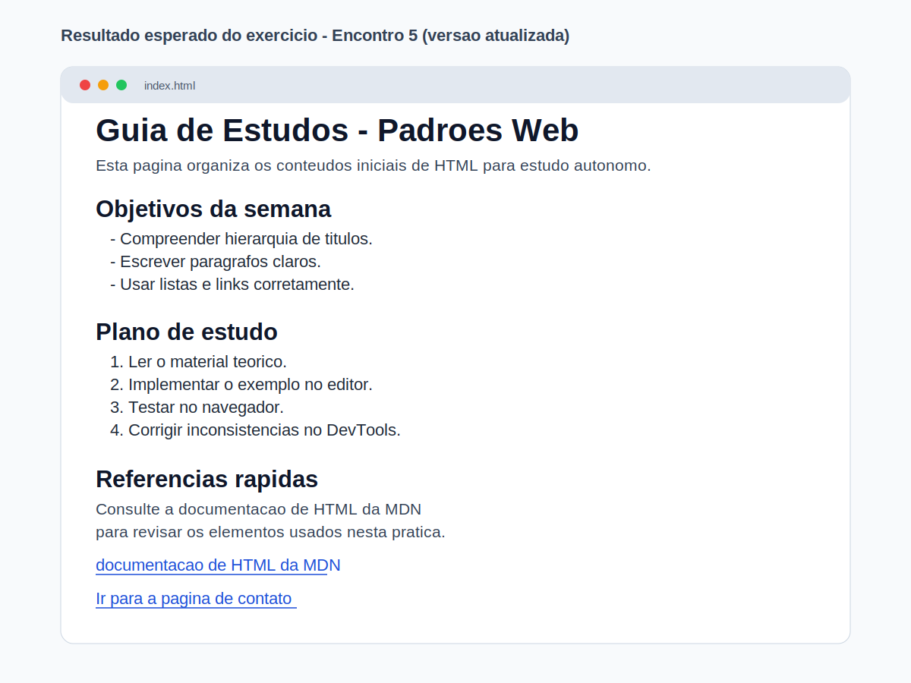

# Encontro 5 - Títulos, Parágrafos, Listas, Links e Organização Textual

**Unidade:** Unidade 1  

## Visão Geral
Neste encontro, você avança da estrutura base do HTML5 para a construção de conteúdo textual legível, navegável e bem organizado.  
O foco é dominar os elementos que aparecem em praticamente toda página web: **títulos**, **parágrafos**, **listas** e **links**.

Se no Encontro 4 você criou seu primeiro `index.html` completo, agora você aprende a organizar informação de forma clara para o usuário e também para manutenção futura do projeto.

## Conceitos Essenciais
- Hierarquia de títulos com `h1` a `h6`.
- Escrita de parágrafos com boa legibilidade.
- Uso correto de listas ordenadas e não ordenadas.
- Criação de links internos e externos.
- Organização textual orientada à leitura do usuário.

## 1) Hierarquia de títulos
Títulos estruturam o conteúdo e ajudam o usuário a entender a página sem esforço.

### Regras práticas iniciais
- Use **um `h1` principal** por página.
- Use `h2` para seções principais.
- Use `h3` para subtópicos dentro de uma seção.
- Evite "pular níveis" sem necessidade (`h1` direto para `h4`, por exemplo).

### Exemplo de hierarquia
```html
<h1>Guia de Estudos de HTML</h1>

<h2>Semana 1</h2>
<h3>Leitura recomendada</h3>
<h3>Exercícios práticos</h3>

<h2>Semana 2</h2>
<h3>Revisão de links e listas</h3>
```

### Por que isso importa?
- Melhora a leitura visual.
- Facilita revisão do conteúdo.
- Prepara o documento para semântica mais avançada nos próximos encontros.

## 2) Parágrafos: construindo blocos de texto
O elemento `<p>` representa um bloco de texto com ideia completa.  
Evite usar quebras de linha (`<br>`) para simular parágrafos.

### Exemplo com parágrafos
```html
<p>HTML organiza o conteúdo da página com elementos de significado.</p>
<p>Neste encontro, o foco é estruturar textos para leitura clara e manutenção simples.</p>
```

### Boa prática de escrita para web
- Frases curtas e diretas.
- Um assunto por parágrafo.
- Vocabulário técnico com explicação objetiva.

## 3) Listas: quando usar `ul` e `ol`
Listas ajudam a apresentar informações de forma rápida e escaneável.

### Lista não ordenada (`ul`)
Use quando a ordem dos itens não altera o sentido.

```html
<h2>Materiais da aula</h2>
<ul>
  <li>Editor de código</li>
  <li>Navegador</li>
  <li>DevTools</li>
</ul>
```

### Lista ordenada (`ol`)
Use quando existe sequência.

```html
<h2>Etapas da prática</h2>
<ol>
  <li>Criar o arquivo HTML.</li>
  <li>Adicionar títulos e parágrafos.</li>
  <li>Inserir listas e links.</li>
  <li>Validar no navegador.</li>
</ol>
```

## 4) Links com `<a>`: conectando conteúdos
Links tornam a página navegável e conectam o conteúdo a outras páginas e recursos.

### Link externo
```html
<a href="https://developer.mozilla.org/pt-BR/docs/Web/HTML">Documentação HTML na MDN</a>
```

### Link interno (mesmo projeto)
```html
<a href="./contato.html">Ir para a página de contato</a>
```

### Link para seção da própria página
```html
<a href="#referencias">Ir para referências</a>
```

```html
<h2 id="referencias">Referências</h2>
```

### Cuidados importantes
- O texto do link deve indicar destino real (evite "clique aqui").
- Sempre confira se o caminho do arquivo está correto.
- Evite links quebrados antes de entregar a atividade.

## 5) Organização textual orientada ao usuário
Neste momento da disciplina, organizar texto bem é mais importante do que "deixar bonito".  
Uma página textual bem estruturada:

- facilita leitura em poucos segundos;
- melhora a compreensão do conteúdo;
- reduz erro de interpretação;
- prepara a base para CSS e semântica HTML5.

### Estratégia prática de organização
1. Defina o objetivo da página em uma frase.
2. Escreva um título principal (`h1`).
3. Quebre o conteúdo em seções (`h2`).
4. Use parágrafos curtos.
5. Transforme sequências em listas.
6. Adicione links de apoio.

## 6) Exemplo principal do encontro (`index.html`)
```html
<!doctype html>
<html lang="pt-BR">
  <head>
    <meta charset="UTF-8" />
    <meta name="viewport" content="width=device-width, initial-scale=1.0" />
    <title>Encontro 5 - Organização Textual</title>
  </head>
  <body>
    <main>
      <h1 id="topo">Guia de Estudos - Padrões Web</h1>
      <p>Esta página organiza os conteúdos iniciais de HTML para estudo autônomo.</p>

      <h2>Objetivos da semana</h2>
      <ul>
        <li>Compreender hierarquia de títulos.</li>
        <li>Escrever parágrafos claros.</li>
        <li>Usar listas e links corretamente.</li>
      </ul>

      <h2>Plano de estudo</h2>
      <ol>
        <li>Ler o material teórico.</li>
        <li>Implementar o exemplo no editor.</li>
        <li>Testar no navegador.</li>
        <li>Corrigir inconsistências no DevTools.</li>
      </ol>

      <h2>Referências rápidas</h2>
      <p>
        Consulte a
        <a href="https://developer.mozilla.org/pt-BR/docs/Web/HTML">documentação de HTML da MDN</a>
        para revisar os elementos usados nesta prática.
      </p>

      <p><a href="#topo">Voltar ao início</a></p>
    </main>
  </body>
</html>
```

## 7) Exercício 
Crie uma página textual estruturada com:
- 1 título principal (`h1`);
- pelo menos 3 seções com `h2`;
- no mínimo 3 parágrafos;
- 1 lista não ordenada;
- 1 lista ordenada;
- 2 links funcionais (um externo e um interno).

Nome sugerido do arquivo: `index.html`.

**Exemplo visual do resultado esperado:**


## 8) Validação rápida antes de considerar concluído
- Há apenas um `h1` representando o tema da página.
- Os títulos seguem hierarquia lógica (`h1` -> `h2` -> `h3`, quando necessário).
- Parágrafos estão claros e sem blocos de texto excessivamente longos.
- Listas foram escolhidas de acordo com o objetivo (ordem ou não ordem).
- Todos os links funcionam ao clicar.

## 9) Erros comuns de iniciantes
- usar títulos apenas para "deixar grande", sem hierarquia;
- escrever tudo em um único parágrafo;
- usar lista ordenada quando os itens não têm sequência;
- inserir links com texto genérico ("clique aqui");
- esquecer de testar caminhos de links internos.

## Materiais para Aprofundamento
- [MDN - Elementos de conteúdo textual](https://developer.mozilla.org/pt-BR/docs/Web/HTML/Guides/Text_content)
- [MDN - Headings and sections](https://developer.mozilla.org/en-US/docs/Web/HTML/Reference/Elements/Heading_Elements)
- [MDN - Elemento `<p>`](https://developer.mozilla.org/pt-BR/docs/Web/HTML/Reference/Elements/p)
- [MDN - Elemento `<ul>`](https://developer.mozilla.org/pt-BR/docs/Web/HTML/Reference/Elements/ul)
- [MDN - Elemento `<ol>`](https://developer.mozilla.org/pt-BR/docs/Web/HTML/Reference/Elements/ol)
- [MDN - Elemento `<a>`](https://developer.mozilla.org/pt-BR/docs/Web/HTML/Reference/Elements/a)

## Checklist de Compreensão
- [ ] Consigo estruturar títulos com hierarquia correta.
- [ ] Consigo escrever parágrafos curtos e objetivos para web.
- [ ] Consigo escolher entre `ul` e `ol` de forma consciente.
- [ ] Consigo criar links externos e internos funcionais.
- [ ] Consigo montar uma página textual completa e legível.

## Resumo Final
Neste encontro, você consolidou a base de organização textual do HTML: títulos para hierarquia, parágrafos para clareza, listas para escaneabilidade e links para navegação. Essa competência é essencial para os próximos encontros, especialmente para semântica HTML5, acessibilidade e estrutura de conteúdo mais robusta.

## Questões de Fixação
1. Qual a função de manter uma hierarquia coerente entre `h1`, `h2` e `h3`?

2. Em que situação é melhor usar lista ordenada (`ol`) em vez de lista não ordenada (`ul`)?

3. Por que não é recomendável usar `<br>` para separar blocos grandes de texto?

4. Qual a diferença entre um link externo e um link interno?

5. Cite dois critérios de validação para considerar uma página textual bem estruturada.
