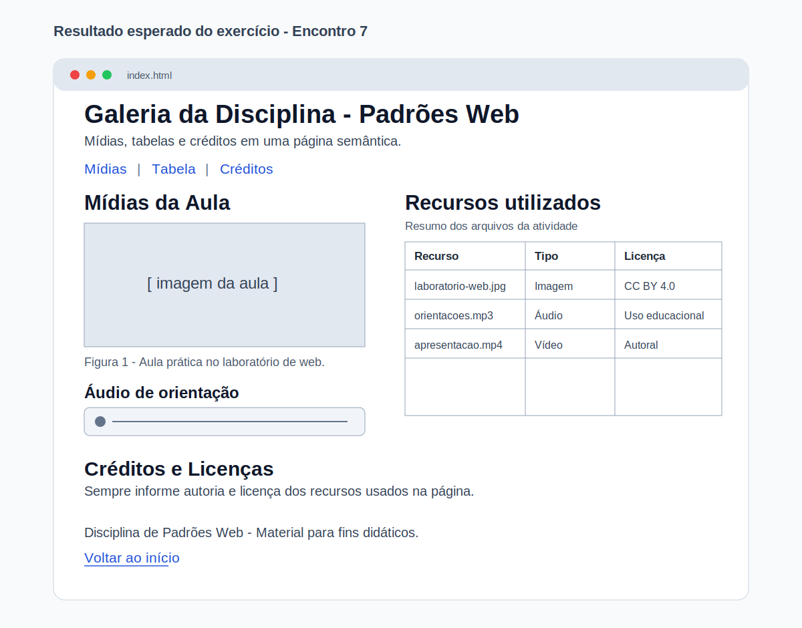

# Encontro 7 - Imagens, Mídias, Figuras, Tabelas e Licenças

**Unidade:** Unidade 1  

## Visão Geral
Neste encontro, você amplia a página semântica com elementos de conteúdo multimídia e dados tabulares.
O foco é publicar informação com contexto, legibilidade e responsabilidade no uso de recursos externos.

Se no Encontro 6 você organizou a arquitetura da página com landmarks, agora você evolui para incluir `img`, `figure`, `figcaption`, `audio`, `video`, `table` e boas práticas de créditos/licenças.

## Conceitos Essenciais
- Uso correto de imagens com `alt` descritivo.
- Diferença entre `img` isolada e `figure` com `figcaption`.
- Inserção básica de áudio e vídeo com controles nativos.
- Estruturação de tabelas com `caption`, `thead`, `tbody`, `th` e `td`.
- Créditos e licenças de uso de mídia.

## 1) Imagens com contexto e acessibilidade
A tag `` insere imagem na página. O atributo `alt` é obrigatório para descrever o conteúdo quando a imagem não carrega ou para tecnologias assistivas.

### Exemplo básico
```html

```

### Boas práticas iniciais
- use nome de arquivo claro e sem espaços;
- escreva `alt` objetivo e informativo;
- evite imagens sem relação com o tema da página.

## 2) Mídias com `audio` e `video`
HTML5 permite incluir áudio e vídeo sem bibliotecas externas, usando controles nativos do navegador.
As mídias podem ser locais (arquivos do projeto) ou remotas (URL da internet).

### Exemplo de áudio
```html
<audio controls>
  <source src="./assets/midias/aviso.mp3" type="audio/mpeg" />
  Seu navegador não suporta áudio HTML5.
</audio>
```

### Exemplo de vídeo
```html
<video controls width="480">
  <source src="./assets/midias/apresentacao.mp4" type="video/mp4" />
  Seu navegador não suporta vídeo HTML5.
</video>
```

### Exemplos com mídia da internet (URL externa)
```html
<audio controls>
  <source src="https://interactive-examples.mdn.mozilla.net/media/cc0-audio/t-rex-roar.mp3" type="audio/mpeg" />
  Seu navegador não suporta áudio HTML5.
</audio>
```

```html
<video controls width="480">
  <source src="https://interactive-examples.mdn.mozilla.net/media/cc0-videos/flower.mp4" type="video/mp4" />
  Seu navegador não suporta vídeo HTML5.
</video>
```

### Resultado prático
- o usuário controla reprodução, pausa e volume;
- o conteúdo audiovisual fica integrado ao documento.
- com URL externa, o carregamento depende da conexão e da disponibilidade do servidor.

### Cuidados ao usar mídia da internet
- use links `https`;
- confirme a licença de uso do conteúdo;
- evite depender de arquivos que possam sair do ar sem aviso.

## 3) Tabelas para dados estruturados
Tabela deve ser usada para dados tabulares, não para layout.

### Estrutura recomendada
```html
<table>
  <caption>Cronograma de entregas</caption>
  <thead>
    <tr>
      <th scope="col">Item</th>
      <th scope="col">Formato</th>
      <th scope="col">Prazo</th>
    </tr>
  </thead>
  <tbody>
    <tr>
      <td>Página semântica</td>
      <td>HTML</td>
      <td>Semana 7</td>
    </tr>
  </tbody>
</table>
```

### Por que isso importa?
- melhora leitura dos dados;
- facilita interpretação por ferramentas assistivas;
- organiza informação de forma objetiva.

## 4) Créditos e licenças de uso
Nem toda imagem, áudio ou vídeo encontrado na internet pode ser usado livremente.

### Regras práticas iniciais
- prefira mídias autorais ou de bancos com licença clara;
- registre fonte e tipo de licença na própria página;
- evite copiar conteúdo sem permissão.

### Exemplo de crédito
```html
<p>
  Imagem: Foto de laboratório por Nome do Autor,
  licenciada em Creative Commons BY 4.0.
</p>
```

## 5) Exemplo principal do encontro (`index.html`)
```html
<!doctype html>
<html lang="pt-BR">
  <head>
    <meta charset="UTF-8" />
    <meta name="viewport" content="width=device-width, initial-scale=1.0" />
    <title>Encontro 7 - Mídias e Tabelas</title>
  </head>
  <body>
    <header>
      <h1 id="topo">Galeria da Disciplina - Padrões Web</h1>
      <p>Mídias, tabelas e créditos em uma página semântica.</p>
    </header>

    <nav aria-label="Navegação principal">
      <a href="#midias">Mídias</a> |
      <a href="#tabela">Tabela</a> |
      <a href="#creditos">Créditos</a>
    </nav>

    <main>
      <section id="midias">
        <h2>Mídias da Aula</h2>

        <figure>
          
          <figcaption>Figura 1 - Aula prática no laboratório de web.</figcaption>
        </figure>

        <article>
          <h3>Áudio de orientação</h3>
          <audio controls>
            <source src="./assets/midias/orientacoes.mp3" type="audio/mpeg" />
            Seu navegador não suporta áudio HTML5.
          </audio>
        </article>
      </section>

      <section id="tabela">
        <h2>Recursos utilizados</h2>
        <table>
          <caption>Resumo dos arquivos da atividade</caption>
          <thead>
            <tr>
              <th scope="col">Recurso</th>
              <th scope="col">Tipo</th>
              <th scope="col">Licença</th>
            </tr>
          </thead>
          <tbody>
            <tr>
              <td>laboratorio-web.jpg</td>
              <td>Imagem</td>
              <td>CC BY 4.0</td>
            </tr>
            <tr>
              <td>orientacoes.mp3</td>
              <td>Áudio</td>
              <td>Uso educacional</td>
            </tr>
            <tr>
              <td>apresentacao.mp4</td>
              <td>Vídeo</td>
              <td>Autoral</td>
            </tr>
          </tbody>
        </table>
      </section>

      <aside id="creditos">
        <h2>Créditos e Licenças</h2>
        <p>Sempre informe autoria e licença dos recursos usados na página.</p>
      </aside>
    </main>

    <footer>
      <p>Disciplina de Padrões Web - Material para fins didáticos.</p>
      <p><a href="#topo">Voltar ao início</a></p>
    </footer>
  </body>
</html>
```

## 6) Exercício
Crie uma página `index.html` com estrutura semântica contendo:
- `header` com título da página;
- `nav` com pelo menos 3 links internos;
- `main` com 2 seções (`section`);
- 1 `figure` com `img` e `figcaption`;
- 1 mídia (`audio` ou `video`) com `controls` (arquivo local ou URL externa);
- 1 tabela com `caption`, `thead`, `tbody`, `th` e `td`;
- bloco de créditos/licença e `footer` com link interno.

**Exemplo visual do resultado esperado:**


## 7) Validação rápida antes de considerar concluído
- A imagem possui `alt` descritivo.
- A `figure` possui `figcaption` coerente.
- O áudio/vídeo possui `controls`.
- Se a mídia for externa, a URL funciona e tem licença adequada.
- A tabela possui cabeçalho e dados bem separados.
- Existe informação de crédito/licença dos recursos.
- O `footer` fecha a página com informação final.

## 8) Erros comuns de iniciantes
- usar imagem sem `alt`;
- inserir tabela para "organizar layout";
- esquecer `caption` na tabela;
- adicionar mídia sem informar formato/fonte;
- usar conteúdo de terceiros sem crédito ou licença.

## Materiais para Aprofundamento
- [MDN - Elemento ``](https://developer.mozilla.org/pt-BR/docs/Web/HTML/Reference/Elements/img)
- [MDN - Elemento `<figure>`](https://developer.mozilla.org/pt-BR/docs/Web/HTML/Reference/Elements/figure)
- [MDN - Elemento `<audio>`](https://developer.mozilla.org/pt-BR/docs/Web/HTML/Reference/Elements/audio)
- [MDN - Elemento `<video>`](https://developer.mozilla.org/pt-BR/docs/Web/HTML/Reference/Elements/video)
- [MDN - Elemento `<table>`](https://developer.mozilla.org/pt-BR/docs/Web/HTML/Reference/Elements/table)
- [Creative Commons - Licenças](https://creativecommons.org/licenses/)

## Checklist de Compreensão
- [ ] Consigo inserir imagem com `alt` adequado.
- [ ] Consigo usar `figure` e `figcaption` com contexto.
- [ ] Consigo incluir áudio/vídeo com controles nativos.
- [ ] Consigo estruturar tabela com cabeçalho e corpo.
- [ ] Consigo creditar recursos com licença apropriada.

## Resumo Final
Neste encontro, você passou a integrar conteúdos visuais, sonoros e tabulares de forma semântica e organizada. Essa etapa amplia a qualidade técnica da página e reforça responsabilidade no uso de mídias de terceiros.

## Questões de Fixação
1. Qual é a função do atributo `alt` em uma imagem?

2. Quando usar `figure` com `figcaption` em vez de apenas `img`?

3. Por que tabela não deve ser usada para layout da página?

4. Qual a importância de `caption`, `thead` e `tbody` em uma tabela?

5. Cite dois cuidados ao usar mídia de terceiros em uma página web.
