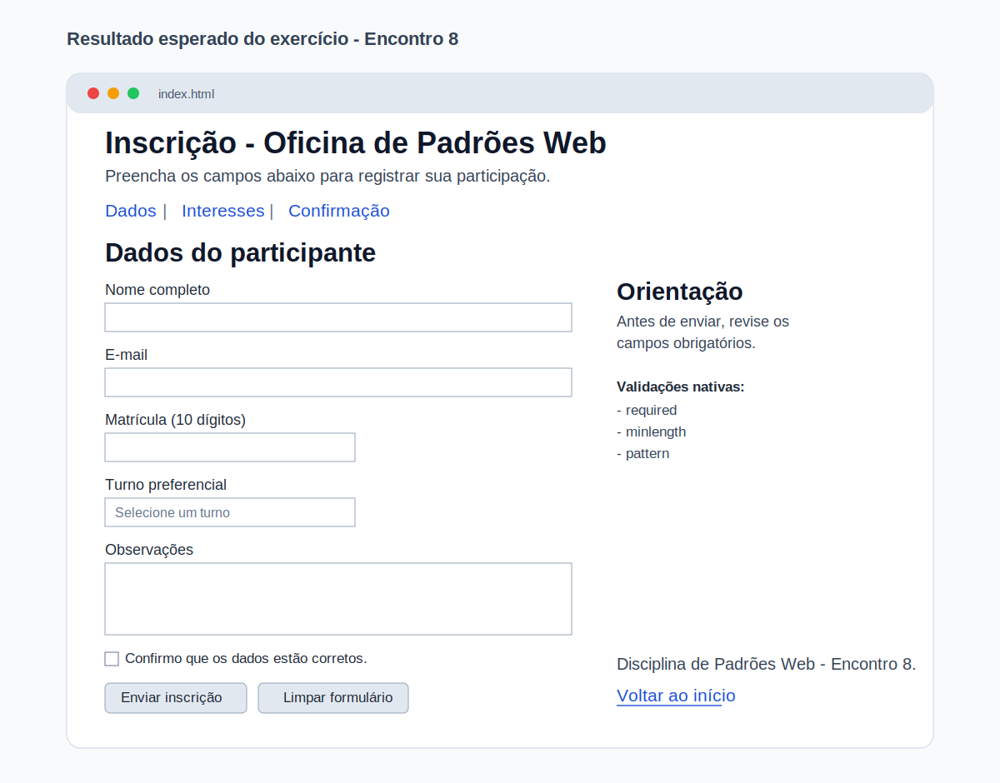

# Encontro 8 - Formulários HTML e Validações Nativas

**Unidade:** Unidade 1  

## Visão Geral
Neste encontro, você aprende a coletar dados do usuário com formulários HTML e validar entradas sem JavaScript.
O foco é criar formulários funcionais, legíveis e com campos adequados para cada tipo de informação.

Se no Encontro 7 você trabalhou com mídias e tabelas, agora você avança para `form`, `label`, `input`, `select`, `textarea` e atributos de validação nativa.

## Conceitos Essenciais
- Estrutura básica de um formulário com `form`.
- Associação correta entre `label` e campos.
- Uso dos tipos de `input` mais comuns.
- Validações nativas com `required`, `minlength`, `maxlength`, `min`, `max` e `pattern`.
- Organização de formulário para melhor experiência de preenchimento.

## 1) Para que servem formulários em HTML?
Formulários permitem capturar dados do usuário para cadastro, contato, inscrição, pesquisa e outras ações.

### Estrutura mínima
```html
<form action="#" method="post">
  <label for="nome">Nome</label>
  <input id="nome" name="nome" type="text" />

  <button type="submit">Enviar</button>
</form>
```

## 2) `label` e campos: associação obrigatória
Cada campo precisa de rótulo claro para orientar o usuário e melhorar acessibilidade.

### Exemplo
```html
<label for="email">E-mail institucional</label>
<input id="email" name="email" type="email" />
```

### Resultado prático
- facilita preenchimento;
- melhora navegação por teclado;
- torna o formulário mais compreensível.

## 3) Tipos de campos mais usados
Escolher o tipo certo reduz erro de preenchimento.

### Exemplos comuns
```html
<input type="text" name="nome" />
<input type="email" name="email" />
<input type="tel" name="telefone" />
<input type="number" name="idade" min="16" max="100" />
<input type="date" name="data" />
<select name="turno">
  <option value="">Selecione</option>
  <option value="matutino">Matutino</option>
  <option value="vespertino">Vespertino</option>
  <option value="noturno">Noturno</option>
</select>
<textarea name="mensagem" rows="4" cols="30"></textarea>
```

## 4) Validações nativas 
O navegador já oferece validações básicas com atributos HTML.

### Exemplo com validação
```html
<input type="text" name="nome" required minlength="3" maxlength="60" />
<input type="email" name="email" required />
<input type="text" name="matricula" pattern="[0-9]{10}" required />
```

### O que o navegador valida automaticamente?
- campos obrigatórios não preenchidos;
- formato de e-mail inválido;
- tamanho mínimo ou máximo fora do esperado;
- padrão regex quando `pattern` é informado.

## 5) Exemplo principal do encontro (`index.html`)
```html
<!doctype html>
<html lang="pt-BR">
  <head>
    <meta charset="UTF-8" />
    <meta name="viewport" content="width=device-width, initial-scale=1.0" />
    <title>Encontro 8 - Formulários HTML</title>
  </head>
  <body>
    <header>
      <h1 id="topo">Inscrição - Oficina de Padrões Web</h1>
      <p>Preencha os campos abaixo para registrar sua participação.</p>
    </header>

    <nav aria-label="Navegação principal">
      <a href="#dados">Dados</a> |
      <a href="#interesses">Interesses</a> |
      <a href="#confirmacao">Confirmação</a>
    </nav>

    <main>
      <section id="dados">
        <h2>Dados do participante</h2>

        <form action="#" method="post">
          <p>
            <label for="nome">Nome completo</label><br />
            <input id="nome" name="nome" type="text" required minlength="3" maxlength="80" />
          </p>

          <p>
            <label for="email">E-mail</label><br />
            <input id="email" name="email" type="email" required />
          </p>

          <p>
            <label for="matricula">Matrícula (10 dígitos)</label><br />
            <input id="matricula" name="matricula" type="text" pattern="[0-9]{10}" required />
          </p>

          <p>
            <label for="turno">Turno preferencial</label><br />
            <select id="turno" name="turno" required>
              <option value="">Selecione um turno</option>
              <option value="matutino">Matutino</option>
              <option value="vespertino">Vespertino</option>
              <option value="noturno">Noturno</option>
            </select>
          </p>

          <p>
            <label for="mensagem">Observações</label><br />
            <textarea id="mensagem" name="mensagem" rows="4" cols="40" placeholder="Informe necessidades ou dúvidas."></textarea>
          </p>

          <p>
            <input id="aceite" name="aceite" type="checkbox" required />
            <label for="aceite">Confirmo que os dados estão corretos.</label>
          </p>

          <p id="confirmacao">
            <button type="submit">Enviar inscrição</button>
            <button type="reset">Limpar formulário</button>
          </p>
        </form>
      </section>

      <aside id="interesses">
        <h2>Orientação</h2>
        <p>Antes de enviar, revise os campos obrigatórios marcados pelo navegador.</p>
      </aside>
    </main>

    <footer>
      <p>Disciplina de Padrões Web - Encontro 8.</p>
      <p><a href="#topo">Voltar ao início</a></p>
    </footer>
  </body>
</html>
```

## 6) Exercício
Crie uma página `index.html` com formulário funcional contendo:
- `header` com título e breve orientação;
- `nav` com pelo menos 3 links internos;
- `main` com ao menos 1 `section` e 1 `aside`;
- formulário com campos: nome, e-mail, matrícula e mensagem;
- pelo menos 3 validações nativas (`required`, `minlength`, `pattern`, etc.);
- botões de envio e limpeza;
- `footer` com informação final e link interno.

**Exemplo visual do resultado esperado:**


## 7) Validação rápida antes de considerar concluído
- Todos os campos possuem `label` associada.
- Campos obrigatórios estão com `required`.
- E-mail usa `type="email"`.
- Matrícula usa `pattern` coerente com o formato solicitado.
- Formulário possui botão de envio e limpeza.
- O `footer` encerra a página com link de retorno.

## 8) Erros comuns de iniciantes
- criar campo sem `name`;
- esquecer de associar `label` com `for`;
- usar `type="text"` para tudo;
- depender apenas de placeholder sem rótulo;
- não testar as validações no navegador antes de entregar.

## Materiais para Aprofundamento
- [MDN - Formulários HTML](https://developer.mozilla.org/pt-BR/docs/Learn_web_development/Extensions/Forms)
- [MDN - Elemento `<form>`](https://developer.mozilla.org/pt-BR/docs/Web/HTML/Reference/Elements/form)
- [MDN - Elemento `<input>`](https://developer.mozilla.org/pt-BR/docs/Web/HTML/Reference/Elements/input)
- [MDN - Elemento `<label>`](https://developer.mozilla.org/pt-BR/docs/Web/HTML/Reference/Elements/label)
- [MDN - Elemento `<select>`](https://developer.mozilla.org/pt-BR/docs/Web/HTML/Reference/Elements/select)
- [MDN - Validação de formulários no lado do cliente](https://developer.mozilla.org/pt-BR/docs/Learn_web_development/Extensions/Forms/Form_validation)

## Checklist de Compreensão
- [ ] Consigo montar um formulário HTML completo.
- [ ] Consigo associar corretamente `label` e campos.
- [ ] Consigo escolher tipos adequados de `input`.
- [ ] Consigo aplicar validações nativas sem JavaScript.
- [ ] Consigo testar envio e limpeza no navegador.

## Resumo Final
Neste encontro, você estruturou formulários HTML com validação nativa para capturar dados de forma organizada e confiável. Essa base é essencial para as próximas etapas da disciplina, especialmente quando os formulários forem estilizados com CSS e integrados a fluxos mais completos.

## Questões de Fixação
1. Por que cada campo de formulário deve ter `label` associada?

2. Qual a vantagem de usar `type="email"` em vez de `type="text"` para e-mail?

3. O que muda no comportamento do navegador quando usamos `required`?

4. Em que situação `pattern` é útil em formulários?

5. Cite dois erros comuns que comprometem a qualidade de um formulário HTML.
